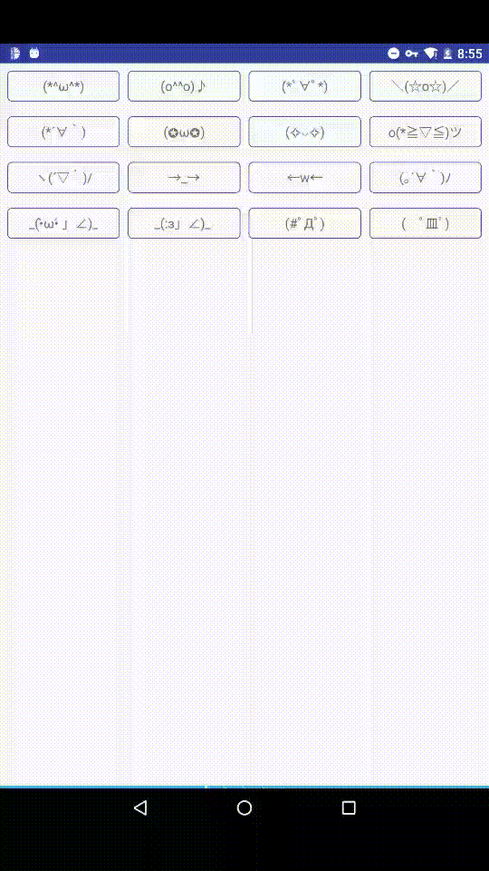
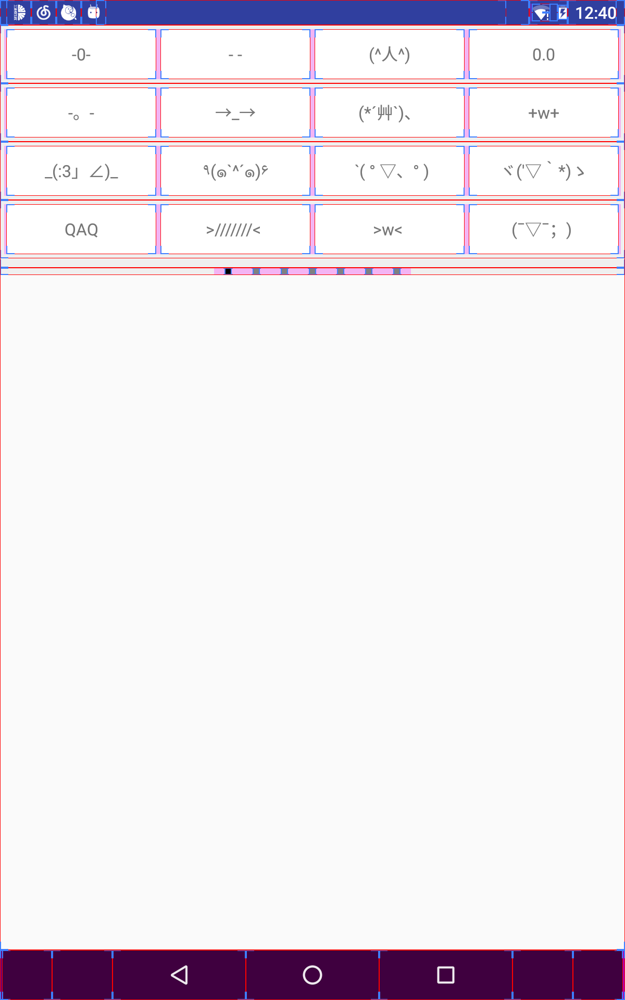

## FaceTextInputLayout

[](https://jitpack.io/#HelloVass/FaceTextLayout)
### 问题
如何对长度不一的颜文字进行**整齐**的排版呢！


### Thanks
> 真的非常感谢这位童鞋提供的思路，大家有兴趣可以看看 [FaceText](https://github.com/songhanghang/FaceText)！

### 功能
1. 模仿 **QQ输入法颜文字** 的排版
2. 为颜文字设置 **selector**
3. 提供颜文字**点击回调**接口 
4. ...


### 效果演示



### 小瑕疵

1.虽然改进版的排版算法已经可以排版排的很漂亮了，但是，如果要让用户体验更棒，建议还是辛苦下**产品童鞋**给颜文字排下版吧！

2.尽可能地降低 View 层级



3.玄学曲线


### 用法

```java
public class FaceLayoutDemoActivity extends AppCompatActivity {

  @Override protected void onCreate(Bundle savedInstanceState) {
    super.onCreate(savedInstanceState);
    setContentView(R.layout.activity_face_text_demo);

    FaceTextInputLayout faceTextInputLayout =
        (FaceTextInputLayout) findViewById(R.id.tv_face_text_input_layout);

    // 设置“颜文字source”
    faceTextInputLayout.setFaceTextSource(new RawSource(this,R.raw.face_text));

    // 设置点击事件
    faceTextInputLayout.setOnFaceTextClickListener(new OnFaceTextClickListener() {
      @Override public void onFaceTextClick(FaceText faceText) {
        Toast.makeText(FaceLayoutDemoActivity.this, faceText.content, Toast.LENGTH_SHORT).show();
      }
    });
  }
}

```

