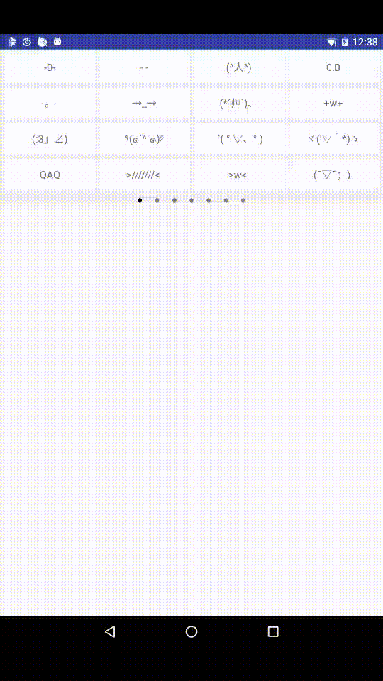

## FaceTextLayoutDemo


### 问题
1. 颜文字长度不一，整齐的排版对用户来说非常重要！


### Thanks
> 非常感谢这位童鞋提供的思路，大家有兴趣可以看看[FaceText](https://github.com/songhanghang/FaceText)！

### 功能
1. 类似 QQ输入法颜文字的**整齐排版**
2. 给颜文字设置 selector
3. ...


### 效果图



### 缺点

1. 要达到整齐美观的效果，需要产品部的童鞋协助，将排版好的颜文字数组发给我。

2. 虽然，我已经尽可能地降低 View 的层级，但还是 QQ输入法颜文字 的性能高。

3. 还没有怎么定制，可扩展性也不强，主要给大家提供一个思路，哈哈...


### 用法

```java
public class FaceLayoutDemoActivity extends AppCompatActivity {

  @Override protected void onCreate(Bundle savedInstanceState) {
    super.onCreate(savedInstanceState);
    setContentView(R.layout.activity_face_text_demo);

    FaceTextInputLayout faceTextInputLayout =
        (FaceTextInputLayout) findViewById(R.id.tv_face_text_input_layout);

    // 设置点击事件
    faceTextInputLayout.setOnFaceTextClickListener(new OnFaceTextClickListener() {
      @Override public void onFaceTextClick(FaceText faceText) {
        Toast.makeText(FaceLayoutDemoActivity.this, faceText.content, Toast.LENGTH_SHORT).show();
      }
    });
  }
}

```

